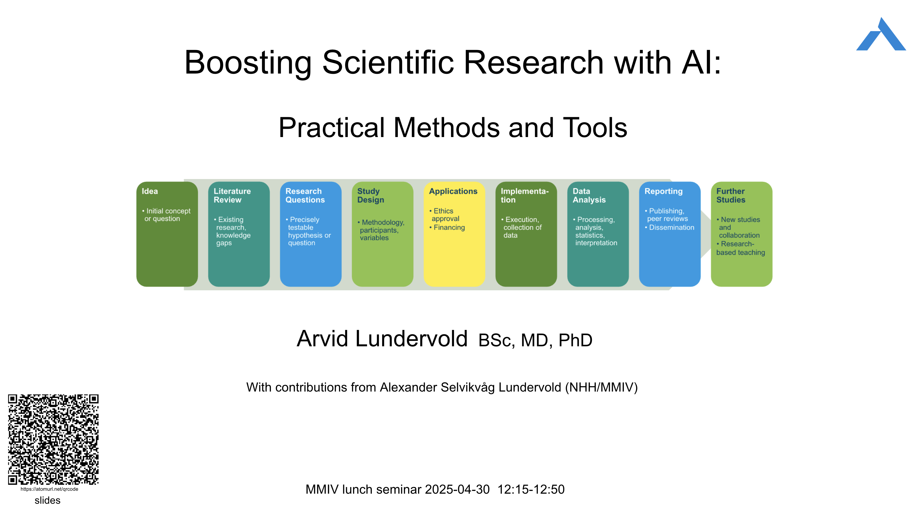

# ChatGPT MedFak dagen 19. april 2023 (ChatGPT)

ChatGPT på Fakultetets dag ved Det medisinske fakultet 19. april 2023  - Hva er ChatGPT og hvordan fungerer det?

----

# IBM's Teaching Day, 24 May 2023 (What about AI?)
(IBM = Instituitt for biomedisin)

OpenAI (ChatGPT) and LLMs: How to explore the possibilities?

----

# TkVestland, 22. juni 2023 (Kunstig intelligens)
(TkVestland = Tannhelsetjenestens kompetansesenter Vestland)

<!-- Kunstig intelligens - muligheter og utfordringer i medisin og helse -->

----

# Joint CEDAS-NORBIS Summer School: Bergen, 7 Aug. 2023 (keynote)

[JOINT CEDAS-NORBIS SUMMER SCHOOL on data science and its biomedical applications: Bergen, 7 – 11 August 2023](https://datascience2023.w.uib.no)

----

# KIN Nettverksmøte #3 Store Språkmodeller 7 Sep. 2023

[KIN = Kunstig intelligens i norsk helsetjeneste](https://ehealthresearch.no/kin)

----

# DIGI116 Medical Data Science, UiB,  25 Sep. 2023

[UiB DIGI-emner høsten 2023](https://www.uib.no/digi/162588/digi-emner-h%C3%B8sten-2023) - [DIGI116](https://www.uib.no/digi/162588/digi-emner-h%C3%B8sten-2023#digi116-nbsp-medical-data-science)

----

# Helse Bergen, Psykiatri Divisjonsledersamling, 14 Feb. 2024

$y \approx f(X, \theta)$, der ($f,\theta$) er GPT-4

Prompt ($X_1$): _Foreslå design og gjennomføring av et KI-prosjekt innen psykoedukativ behandling hos voksne med ADHD_  
$\rightarrow$ Generert [respons](https://chat.openai.com/share/b3eddb96-ccac-4da2-9930-30f3084bb44a) ($y_1$)

Prompt ($X_2$): _Gi eksempler på data som bør samles inn hos en utvalg på 100 personer med ADHD og 50 kontroller og lag en csv-fil for en simulert datainnsamling_   $\rightarrow$
Generert [respons](https://chat.openai.com/share/b5c31e86-8265-47b4-8ea3-10144ced1f6f) ($y_2$)

--> [[simulated_adhd_study_data.csv](./assets/simulated_adhd_study_data.csv)]; [[simulated_adhd_study_data.ipynb](https://nbviewer.org/github/MMIV-ML/ChatGPT-MedFakDagen-20230419/blob/main/assets/simulated_adhd_study_data.ipynb)] - 1-click notebook:   

 
If you have a subscription to [ChatGPT Plus](https://openai.com/blog/chatgpt-plus), you can also try out the [**Medical AI Assistant (UiBmed - ELMED219 & BMED365)**](https://chat.openai.com/g/g-d90dfN17H-medical-ai-assistant-uibmed-elmed219-bmed365) and see if you can get it to answer some of your questions.

-----

# Protonseminar om forskning. Helse Bergen, 21 Mar 2024 
[[link](https://www.helse-bergen.no/arrangementer/protonseminar-om-forsking2)]

-----

# THO802 - KI i Helse, HVL, 18 Apr 2024 
[[THO802](https://www.hvl.no/studier/studieprogram/emne/THO802)]

------

# Filosofisk poliklinikk - KI i medisin og helse, Alrek, 3 Mai 2024 
[«Hva skal medisinen med refleksjon og klokskap, når vi har kunstig intelligens?»](https://filosofiskpoliklinikk.no/03-05-2024)

------

# K2 junior retreat - Using AI in Your Research, Alrek, June 7th 2024 

------

# IBM day at Hotel Scandic Ørnen, Bergen, August 19th 2024

----

# Forskningsdagene Bergen, 27 Sept 2024
[RESEARCHERS’ NIGHT 2024: Magemysteriet!](https://www.uib.no/med/172352/researchers%E2%80%99-night-2024-magemysteriet)   AI-generert podcast [Decoding IBS](assets/Decoding_IBS.mp3)

----

# Shandong University, Jinan, China, 14 Nov 2024

https://www.en.sdu.edu.cn - Institute of Brain and Brain-Inspired Science  |  https://github.com/arvidl/glioma-growth

---

# Haukeland Universitetssykehus, Bergen, 18 Feb 2025

### Fagseminar: "Kunstig intelligens på jobben"

-----

# THO802 - KI i Helse, HVL, 3 Apr 2025 
[[THO802](https://www.hvl.no/studier/studieprogram/emne/THO802)]

-----

# Brain-Gut Meeting: AI in IBS Research - Part 1, AHH, 8 Apr 2025 

-----

# Yngre Kreftlegers Kveldsmøte (YKK), Bergen, 24 Apr 2025

-----

# MMIV Lunch seminar, 30 Apr 2025

-----

# UiB AI [#15](https://www.uib.no/ai/177398/uib-ai-15-ai-higher-education-opportunities-limits-and-ethical-dilemmas) May 9th 2025

-----

# Seminar [eCardiacRehab](https://www.helse-bergen.no/en/procard/ecardiacrehab), Bikuben, May 26th 2025

-----

# HBF meeting [Brain & Consciousness](https://github.com/Brain-and-Consciousness/HBF), Alrek, June 3rd 2025

----- 

# Opening Conference for [Mathematical Challenges in Brain Mechanics](https://cas-nor.no/events/opening-conference-mathematical-challenges-brain-mechanics), CAS, Oslo, August 20th, 2025

----- 

# MedAI - fremtidsutsikter, Solstrand, September 27th, 2025

Solstrand, Bergen

----- 

# China-Europe Brain Science Conference, November 18th, 2025

Qilu Hospital of Shandong University, Dezhou Hopital

-----

# HBF meeting [Brain & Consciousness](https://github.com/Brain-and-Consciousness/HBF), Eitri, January 25th 2026

